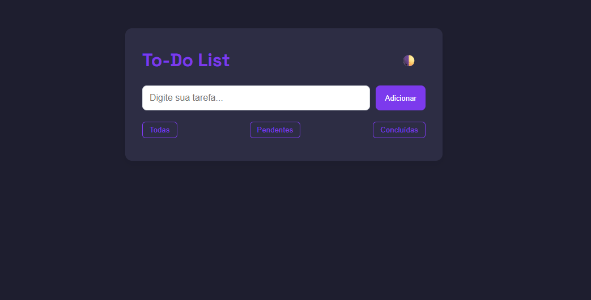

## To-Do List App

Uma aplicação de lista de tarefas moderna, responsiva e leve, desenvolvida com HTML, CSS e JavaScript puro. O projeto permite ao usuário adicionar, remover, marcar tarefas como concluídas e filtrar por status. Além disso, possui modo escuro, que pode ser alternado manualmente e é salvo no navegador, junto com as tarefas via localStorage.

### ✨ Funcionalidades

- ✅ Adicionar tarefas

- 📌 Marcar tarefas como concluídas ou pendentes

- 🗑️ Remover tarefas da lista

- 🔎 Filtro de exibição:

- Todas

- Pendentes

- Concluídas

- 🌙 Modo escuro/claro com botão de alternância

- 💾 Salvamento automático das tarefas e do tema com LocalStorage

### 💻 Tecnologias utilizadas

- LocalStorage para persistência

- FontAwesome para ícones

### 📷 Preview



### 🔗 Acesse o Projeto Online

Você pode visualizar o projeto funcionando aqui:  

👉 [Clique para acessar a To-Do List](https://kevinbaudson.github.io/bloco-de-anota-es---APP/)


### 🚀 Como usar
Clone o repositório:
```
git clone https://github.com/seu-usuario/todo-list.git
```

Abra o arquivo index.html em seu navegador.

Ou use uma extensão como o Live Server no VS Code para melhor experiência.

### 📁 Estrutura do Projeto
```
todo-list/
├── index.html
├── css/
│   └── style.css
├── js/
│   └── script.js
└── README.md
```

### 📌 Observações

- O projeto é totalmente funcional sem frameworks ou bibliotecas externas.

- Recomenda-se usar navegadores modernos para melhor suporte.

- Todas as interações são salvas no navegador com LocalStorage.

### 📫 Contato

- 💼 LinkedIn: [Kevin Baudson](www.linkedin.com/in/kevinbaudson)

- 📧 Email: [kevinbaudson@gmail.com](mailto:kevinbaudson@gmail.com)
